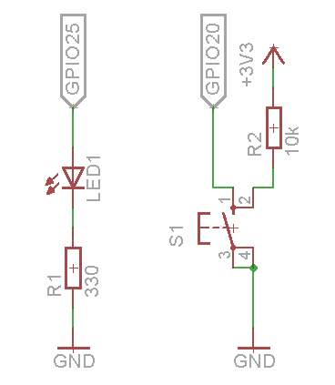

# robosys2016

Simple Device Driver for Raspberry Pi 3 (Raspbian)

## Requirements

* linux kernel source
  * download kernel source into `/usr/src/linux`
  * kernel build scripts : [https://github.com/ryuichiueda/raspberry_pi_kernel_build_scripts](https://github.com/ryuichiueda/raspberry_pi_kernel_build_scripts)
* led
* resistor
  * 330[ohm]
  * 10k[ohm]
* switch

## Installation

### Hardware

Connect led, resistors, switch with Raspberry Pi as shown in schematic.



### Software

First, download this repository.

```
git clone https://github.com/Tiryoh/robosys2016.git
```

Next, move into robosys2016 directory and run make command.

```
cd robosys2016
make && make install
```

## Usage

After installation, test gpio check scripts.  
The LED connected to GPIO25 will blink.

```
./scripts/test_gpio25.sh
```

If you want to turn off the LED when you push the switch button connected to GPIO20, run this command.

```
./scripts/sw_to_led.sh
```

## Reference

https://github.com/rt-net/RaspberryPiMouse

## License

This repository is licensed under the GPLv3 license, see [LICENSE](./LICENSE).
